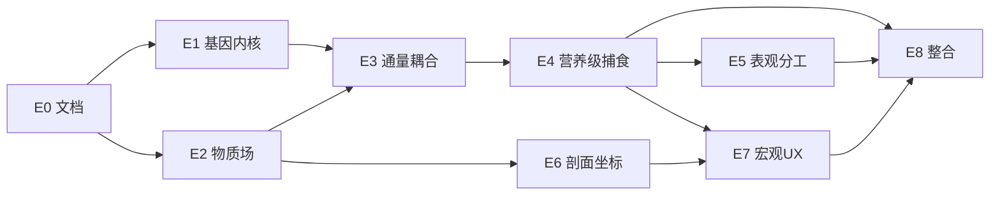

# MiraSpace 米拉地球 · 目标进度路线图

> **状态**：规划基线（2026-08-14）。  
> **前置**：S1–S5 已闭合；基因表达规格见 [`EARTH_GENE_EXPRESSION.md`](EARTH_GENE_EXPRESSION.md）。  
> **设计锁定**：成核 ≥12 bit、捕食仅 biomass、表观分工不写回序列、`stage-earth-default` extends stage5。

---

## 总目标

在 **程序尽量简单** 前提下，实现 **可观测的地球式物质循环 + 营养级涌现**：

- 蓝细菌样生产者固碳产氧 → 大气 O₂ 上升  
- 消费者 / 分解者闭环 → DOC、CO₂ 波动  
- 宏观剖面 UX（B）与微观放大镜并存  
- 画面：简单粒子；信息：HUD + 弹幕 + 快照完整  

**不追求**：3D 球体、万有引力、独立脂肪/蛋白质场、黏附连线动画。

---

## 阶段总览

| 阶段 | 名称 | 交付物 | 验收（smoke / acceptance） |
|------|------|--------|---------------------------|
| **E0** | 文档与命名 | 本文档 + 基因表达规格 + `biology-names` archetype | 文档 review |
| **E1** | 基因表达内核 | ✅ `gene-expression.js`、解码与通量表 | `test-gene-expression.mjs`（smoke 内） |
| **E2** | 物质场与大气 | ✅ CO₂/O₂/DOC/POC + `stage-earth-default` | smoke：`ecologyFieldsBounded` |
| **E3** | 细胞通量耦合 | `chemoton` 调用 `applyGeneFlux`、biomass | smoke：有 vesicle 时通量写入 |
| **E4** | 营养级与捕食 | predator 转移、6 archetype HUD | acceptance：600s O₂↑、异养出现 |
| **E5** | 表观分工 | colony `effectiveM/T`、快照字段 | smoke：colony≥3 时分化位可见 |
| **E6** | 剖面坐标（B） | y=海拔/深度、经度 pan、光照深度 | 视觉 + 光场随 pan 变化 |
| **E7** | 宏观 UX | 包络去连线、植物锚定、放大镜 | 手动 / 录屏验收 |
| **E8** | 里程碑与 Tab | `stage-earth-default`、科技树、弹幕 | smoke 全绿 + 里程碑触发 |

E0 在本 PR 合并；E1–E8 为后续迭代。

---

## E1 — 基因表达内核

**范围**

- 新建 `site/js/gene-expression.js`
- `decodeSequence(sequence)` → `{ M, T, R, archetype, effectiveM, effectiveT }`
- `computeFlux(archetype, env, E)` → `{ dDOC, dCO2, dO2, dWaste }`
- `site/js/biology-names.js` 增加 `ARCHETYPES` 中英文

**不含**：场更新、绘制、preset。

**完成定义**

- `node scripts/test-gene-expression.mjs`（新建）对 6 archetype 与非法组合跑通  
- 碳通量符号与文档 §5 表一致  

**依赖**：无  

**风险**：低  

---

## E2 — 物质场与大气

**范围**

- `fields.js` 扩展 CO₂、O₂、DOC、POC（扩散 + baseline + clamp）  
- `atmosphere` 模块或 `fields` 内：`globalO2`、`globalCO2`、`oceanEquilRate`  
- `stage-earth-default.json` 骨架（extends stage5，仅场配置）  
- 热力图循环增加 CO₂/O₂ 模式  

**完成定义**

- smoke：加载 earth preset 45s 无 NaN、浓度 ∈ [0, max]  
- HUD 可选显示 globalO2（初版文字即可）  

**依赖**：E0  

---

## E3 — 细胞通量耦合

**范围**

- vesicle `biomass` 标量（radius² × 系数）  
- `chemoton.updateMetabolism` 末尾：`applyGeneFlux(vesicle, fields, geneExpression)`  
- 膜内主导 strand 解码；`length < 12` 渗漏  
- `metabolicFlux` / `membraneHealth` 与通量挂钩  

**完成定义**

- smoke：earth preset 下 `globalO2` 有变化（不一定单调升）  
- 守恒：`checkCarbonBudget` 脚本容差内  

**依赖**：E1、E2  

---

## E4 — 营养级与捕食

**范围**

- predator：邻格 biomass 转移 → DOC，无动画  
- 指标：`trophicRichness`、`producerBiomass`、`netOCFlux`  
- 里程碑：`大氧化`（globalO2 阈值）、`好氧消费者扩张`  

**完成定义**（**acceptance 地球切片**）

- preset `stage-earth-default`，seed 42，600 sim s：  
  1. `cyanophyte` 谱系存在  
  2. `globalO2` 上升 ≥ 0.05  
  3. ≥1 异养 archetype 存活  
  4. 碳预算漂移 < 5%  

**依赖**：E3  

---

## E5 — 表观分工

**范围**

- `R` bit3 + colony：`_updatePhenotype` 设 `effectiveM/T`（不写 sequence）  
- 快照 / `data-export`：`effectiveArchetype`  
- 与现有 `colony._updateRoles` 并行；HUD 显示表观营养级  

**完成定义**

- smoke：人为高能 colony 可见 ≥2 种 effectiveArchetype（或指标 `divisionOfLabor` 扩展）  

**依赖**：E4  

---

## E6 — 剖面坐标（B）

**范围**

- 世界语义：`x` = 经度（可见弧段），`y` = 海拔 / 深度  
- 地形格：大气 / 生物圈 / 海洋 / 陆地 / 沉积  
- `light(x,y)` = 日照 × 深度衰减；pan x → 光照相对移动  

**完成定义**

- 横滑一圈，光照带与热力图同步移动  
- 沉积层 y 区间 DOC/POC 基线更高  

**依赖**：E2（光场）  

**备注**：可与 E7 并行一部分 UI  

---

## E7 — 宏观 UX

**范围**

- 删除 colony `drawLinks` 绿线（物理 link 保留）  
- colony≥3：包络轮廓 + 共色  
- 生产者：`mobility=0`、陆地锚定、绿调  
- 局部放大镜：点击格点弹出微观窗口（vesicle + strand + 表达条 M|T|R）  

**完成定义**

- 录屏验收：宏观可辨植物/动物/微生物/多细胞包络  
- 放大镜可开关，不阻塞主循环  

**依赖**：E4、E6（锚定需地形）  

---

## E8 — 整合与导航

**范围**

- 顶栏 Tab：**米拉地球**（`stage-earth-default`）  
- `milestone-conditions` 地球里程碑  
- `ui-guide` / `BIOLOGY_NOMENCLATURE` 更新  
- `s-earth-headless-test.mjs` 或扩展 `run-suite.mjs --smoke-earth`  

**完成定义**

- 全 suite smoke 含 earth 档 exit 0  
- GitHub Pages 可选从米拉地球入口进入  

**依赖**：E4–E7 中核心项（E7 放大镜可标 v1.1）  

---

## 依赖关系图

---

## 建议迭代顺序（执行队列）

1. **E1** → **E2** → **E3**（可测通量，无 UX）  
2. **E4**（科学 closure 关键）  
3. **E5**（分工与快照）  
4. **E6** + **E7**（剖面与画面）  
5. **E8**（产品整合）  

每个阶段：**单独分支** → smoke → PR → merge；acceptance 仅在 E4/E8 跑 600s。

---

## 与现有里程碑的关系

| 现有 | 地球时代 |
|------|----------|
| S1–S5 Tab | 保留，独立 preset |
| S5 colony 指标 | 保留；地球增加 trophic / 大气指标 |
| 科技树 | 增加「米拉地球」列或新树 |
| 弹幕 | 增加大氧化、厌氧带、营养级扩张 |

---

## 文档索引

| 文档 | 内容 |
|------|------|
| [`EARTH_GENE_EXPRESSION.md`](EARTH_GENE_EXPRESSION.md) | 12 bit、6 archetype、通量公式、已确认决策 |
| [`EARTH_ECOSPHERE_ROADMAP.md`](EARTH_ECOSPHERE_ROADMAP.md) | 本文档 |
| [`BIOLOGY_NOMENCLATURE.md`](BIOLOGY_NOMENCLATURE.md) | 粒子与阶段命名（实现时扩展 archetype） |

---

## 下一 PR 建议标题

**E1：gene-expression 解码与通量表（无场耦合）**
